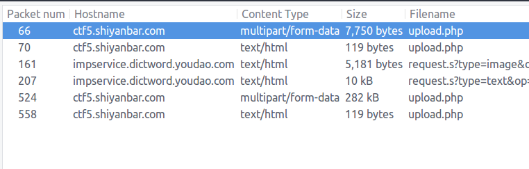
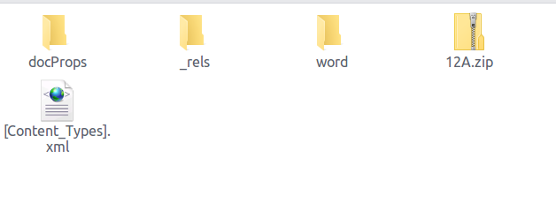
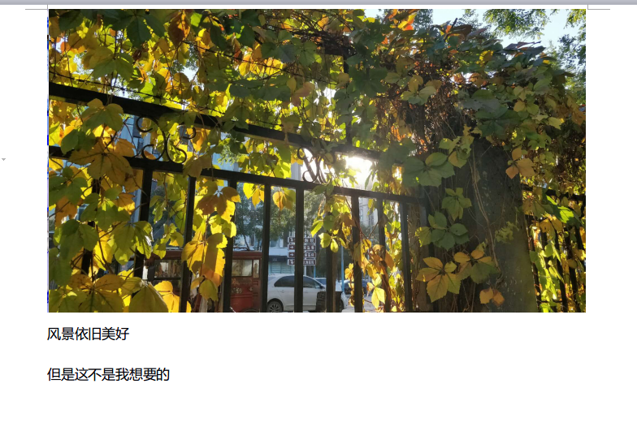
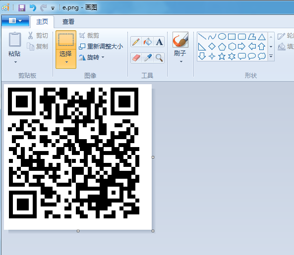

## 啦啦啦

[原题 啦啦啦](http://www.shiyanbar.com/ctf/2024)

将数据包放到`wireshark`，发现有upload关键词，将数据包导出来看看是什么东西 `file > Export Objext`



查看数据包发现上传了`lol.docx`和`LOL.zip`这个文件（题目的名字，感觉flag就是在这里）

用`binwalk`将数据包解出来

- `lol.docx`



将`12A.zip`加上`.docx`后缀，打开发现flag不在这里




- `lol.zip`


这里有四个txt文件，都是熟悉的`89504E470D`PNG文件头，将这几个文件转成png图片


```python
with open("11.png", "wb") as f:
    b = bytes.fromhex(open("11.txt").read().strip())
    f.write(b)

with open("22.png", "wb") as f:
    b = bytes.fromhex(open("22.txt").read().strip())
    f.write(b)

with open("33.png", "wb") as f:
    b = bytes.fromhex(open("33.txt").read().strip())
    f.write(b)

with open("44.png", "wb") as f:
    b = bytes.fromhex(open("44.txt").read().strip())
    f.write(b)
```

转成四个png文件，这四张图片可以合并成一张二维码


不会ps我只能用windows的画图工具来拼了


