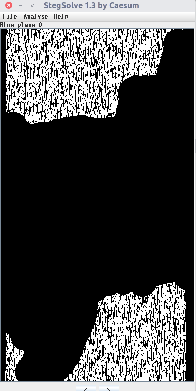
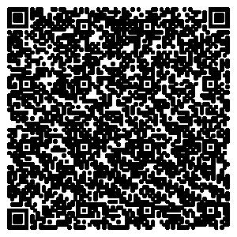

# 心中无码

放到`stegsolve`查看，发现蓝色通道的最低位图片好像有点意思




```python
from PIL import Image
img = Image.open("/home/key/Downloads/ctf/data/Lena.png")

data = []
width, height = img.size

for x in range(width):
    for y in range(height):
        r, g, b = img.getpixel((x, y))
        # 把不是黄色的数据收集起来
        if (r, g, b) != (255, 255, 0):
            if b & 0x01:
                data.append(1)
            else:
                data.append(0)

print(len(data))
# 90000
# 90000 = 300 * 300 可以猜测数据是一张位图


img1 = Image.new("RGB", size=(300, 300), color=(255, 255, 255))
for idx, i in enumerate(data):
    x = idx % 300
    y = idx // 300
    if i == 1:
        img1.putpixel((x, y), (0, 0, 0))
img1.show()
```

得出一张二维码




扫码得到一串`brainfuck`代码
```
+++++++++[->+++++++++<]>++++++++.<++++++[->------<]>--.<+++++[->+++++<]>++++++.<+++++[->+++++<]>++.--------.<+++++++[->-------<]>--.<++++++++[->++++++++<]>++++++.<+++[->---<]>---.<+++[->---<]>-.<+++[->+++<]>++.<++++++[->------<]>---.<+++++[->+++++<]>+++++++.<+++++[->-----<]>.<+++[->+++<]>++.<+++[->---<]>-.<++++[->++++<]>++++++++.<+++[->---<]>----.<++++++[->------<]>--.<+++++[->+++++<]>++++++++++.<++++++[->------<]>--.<+++++[->+++++<]>++++.<+++++[->-----<]>-.---.<+++[->+++<]>++++.<
```


```sh
# https://www.dcode.fr/brainfuck-language
# 解码得到 Y3Rme2xlbmFfMXNfY3V0M30=
>>> echo "Y3Rme2xlbmFfMXNfY3V0M30=" | base64 -d
ctf{lena_1s_cut3}
```
